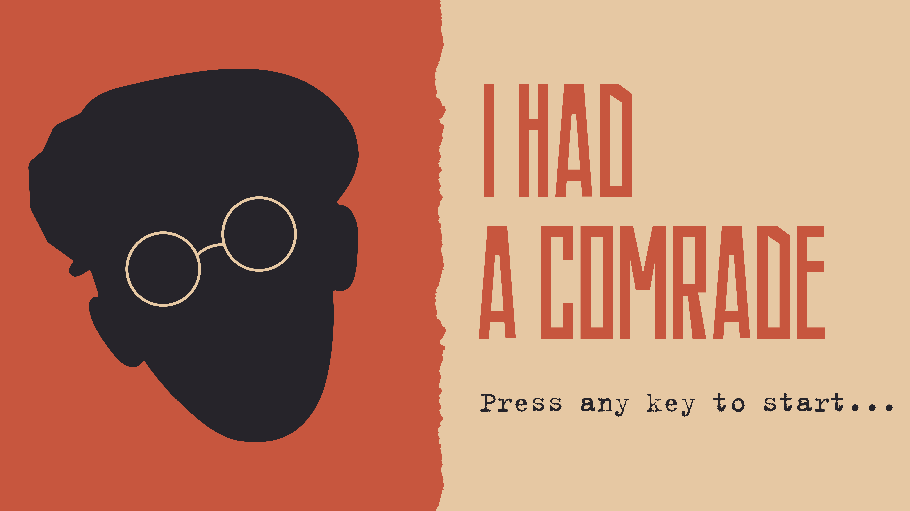
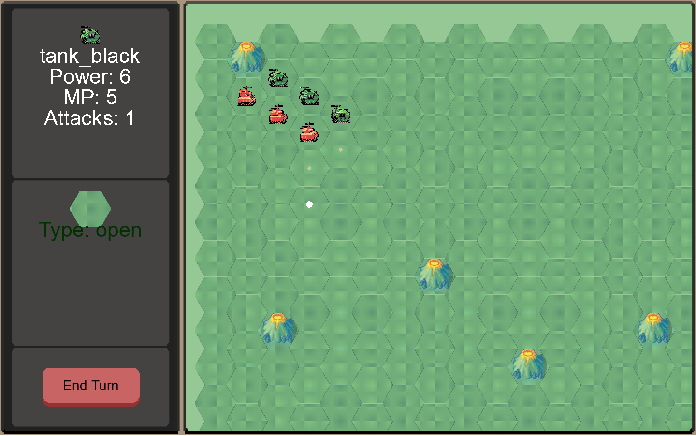

# I_had_a_comrade
Hex and counter wargame.
Work in progress.

  

### How to run it

  

You need pygame for run this project: https://www.pygame.org/wiki/GettingStarted

To run it use ``python main.py``

### Controls

Scroll around the map by ``W`` ``A`` ``S`` ``D`` or ``←`` ``↑`` ``↓`` ``→``.

To select unit use ``LMB``, to move selected unit use ``RMB``

To exit the game, press ``ESC``.

### Screenshot

  

