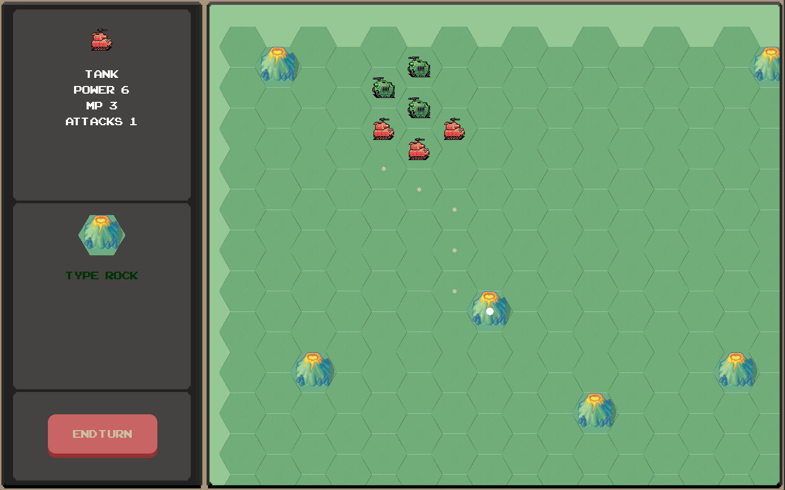

# I_had_a_comrade
Hex and counter wargame.
Work in progress.

  

### How to run it?

  

You need pygame for run this project: https://www.pygame.org/wiki/GettingStarted

To run it use ``python main.py``

### Controls

Scroll around the map by ``W`` ``A`` ``S`` ``D``.

To select and move unit use ``LMB``, to unselected unit use ``RMB``

Use ``Spacebar`` for coordinated attack.

To end turn you can use ``e`` hotkey or interface button

To exit the game, press ``ESC``.

### Screenshot

  

